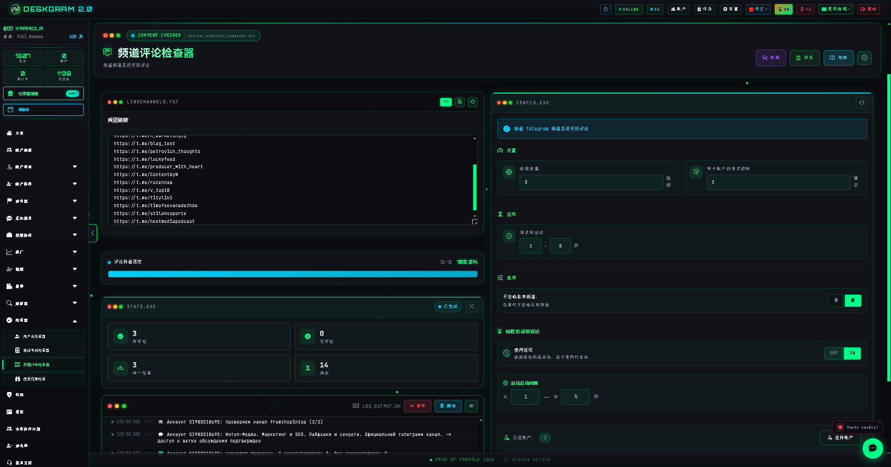
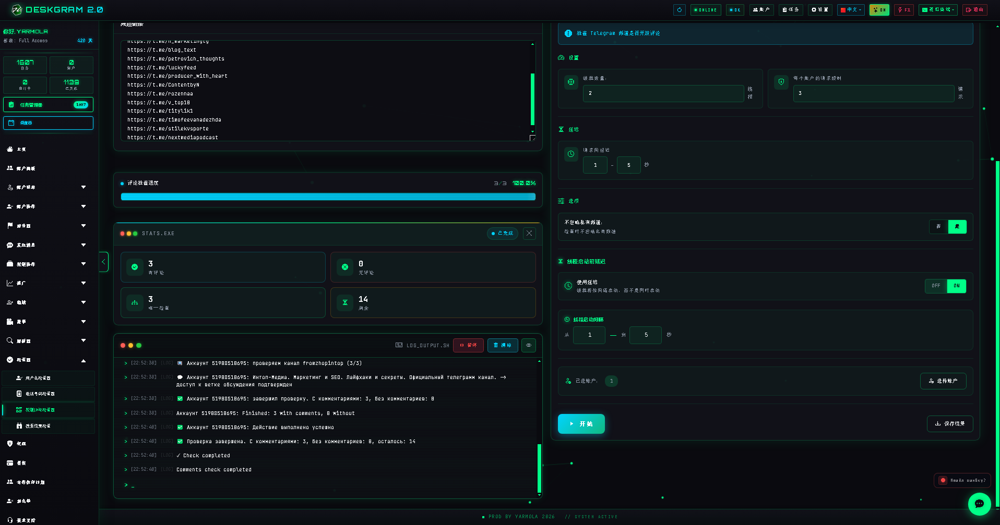
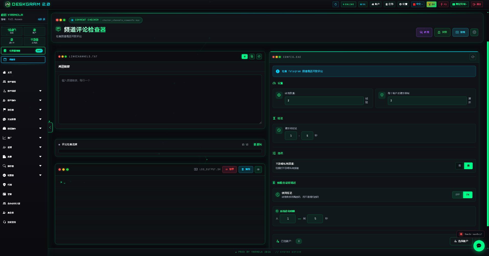
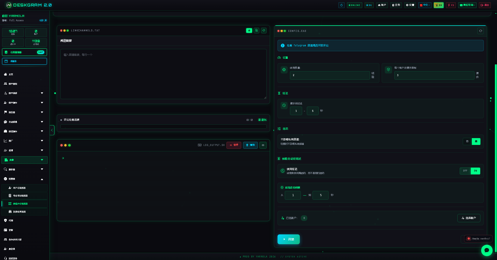

# Deskgram 2 Telegram 频道评论检查器

Deskgram 2 的 Telegram 频道评论检查器可以在你进入评论营销、评论受众采集或社区 engagement 路线之前，先判断频道是否开启评论。这个模块适合在频道列表很大、不想一个个手动打开检查时使用。

[Deskgram 2 Hub](https://github.com/Deskgram-2/deskgram-2-telegram-automation-zh) · [Website](https://deskgram2.com/) · [Telegram Bot](https://t.me/DG2welcomebot) · [Web Preview](https://deskgram2.com/web-preview?path=%2Fapp-demo%2F&lang=cn)

## 交互式 Web Preview

在浏览器里查看模块界面：[打开 web preview](https://deskgram2.com/web-preview?path=%2Fapp-demo%2Ffunctions%2Fchecker_channels_comments&lang=cn)

这样你可以先看过滤器、账号分配和统计区域，再决定是否批量运行检查。

## Screenshots

## 模块概览

| 参数 | 内容 |
|---|---|
| 核心任务 | 在 engagement 前筛选出开启评论的 Telegram 频道 |
| 重要模块 | 主列表、设置、统计、账号分配 |
| 适用场景 | 评论营销、社区 discovery、parser 准备 |
| 相关模块 | AI 评论、评论受众采集、频道搜索 |

## 模块能力

- 在 engagement 前先检查频道是否开启评论；
- 减少大列表上的手动筛选工作；
- 为评论营销或受众采集路线过滤候选频道；
- 在运行过程中持续显示统计；
- 为社区型路线提供更稳定的准备层。

## 快速开始

1. 导入要检查的频道列表。
2. 配置限制、节奏和账号设置。
3. 运行检查并等待结果汇总。
4. 过滤出开启评论的频道。
5. 把验证过的列表送入下一个评论相关模块。

## 最适合和哪些模块联动

- [AI 评论](https://github.com/Deskgram-2/telegram-neuro-commenting-deskgram-zh)
- [评论受众采集](https://github.com/Deskgram-2/telegram-comment-audience-parser-deskgram-zh)
- [频道搜索](https://github.com/Deskgram-2/telegram-channel-search-deskgram-zh)
- [任务管理](https://github.com/Deskgram-2/telegram-task-manager-deskgram-zh)

## 什么时候特别有用

- 当频道列表需要先做评论可用性筛选；
- 当评论营销路线要从已验证社区开始；
- 当 parser 逻辑依赖评论是否开启；
- 当手动逐个检查太慢时。

## 选哪个：评论检查器还是直接做 AI 评论

| 如果你的目标是 | 更适合 |
|---|---|
| 在 engagement 前筛选频道 | `频道评论检查器` |
| 在已验证社区中直接开始评论 | [AI 评论](https://github.com/Deskgram-2/telegram-neuro-commenting-deskgram-zh) |
| 先建立可评论频道名单 | `频道评论检查器` |
| 直接进入评论执行层 | [AI 评论](https://github.com/Deskgram-2/telegram-neuro-commenting-deskgram-zh) |

## Related repositories

- [Deskgram 2 Hub](https://github.com/Deskgram-2/deskgram-2-telegram-automation-zh)
- [AI 评论](https://github.com/Deskgram-2/telegram-neuro-commenting-deskgram-zh)
- [评论受众采集](https://github.com/Deskgram-2/telegram-comment-audience-parser-deskgram-zh)
- [频道搜索](https://github.com/Deskgram-2/telegram-channel-search-deskgram-zh)
- [任务管理](https://github.com/Deskgram-2/telegram-task-manager-deskgram-zh)

## FAQ

### 可以先在浏览器里看模块吗？

可以。浏览器预览已经能直接展示主检查区域、设置、统计和账号模块。

### 这个模块只适合评论营销吗？

不是。只要 parser 或社区 discovery 路线依赖“频道是否开启评论”，它都很有用。
